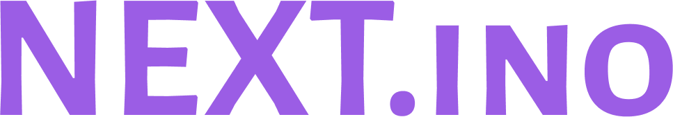

  

# Nextino Framework (v0.1.0)

**Nextino: The Next Step for Arduino. A structured, scalable, and modern C++ framework for Arduino, ESP32, STM32, and beyond.**

## 🎉 The Story Behind Nextino

Nextino's first **public release** coincides with a very special day for me — **my son's birthday**.  
This isn't just a technical milestone; it's a personal one.

---

On this day, I watched my child grow one year older while also giving life to a framework that I hope will empower countless developers around the world.  
Just like my son, Nextino is **just starting its journey**, full of potential and possibilities.

---

Whenever I look back at this release, I'll remember that **Nextino was "born" on the same day as my son** — a symbolic reminder that creation, in any form, is always meaningful.  

I hope Nextino inspires you to **build, explore, and create** — just as much as my son inspires me every day.  

---

> "Two birthdays on the same day: one of my son, one of my creation. Both equally precious." 🎈

---

Tired of messy `.ino` files and endless `loop()` functions? Nextino brings the power of modern software architecture to the embedded world, allowing you to build complex, maintainable, and reusable projects with ease.

This framework is built for developers who love the simplicity of the Arduino ecosystem but need the structure and power of a professional IoT framework.

---

## ✨ Key Features (v0.1.0)

* **Modular Architecture:** Build your application from independent, reusable modules (`BaseModule`).
* **Plug-and-Play:** Add modules to your project's `lib` folder, and Nextino's build script automatically discovers and configures them. Your `main.cpp` stays clean!
* **Configuration-Driven:** Modules are configured via `config.json` files, separating logic from configuration.
* **Non-Blocking Scheduler:** Run periodic tasks efficiently without using `delay()`.
* **Professional Logging:** A built-in, colored, and leveled logger that makes debugging a pleasure.
* **Clean Core:** A minimal core featuring a `SystemManager`, `ModuleFactory`, and `Scheduler`.

---

## ❓ Why Nextino?

Arduino made embedded development accessible for everyone, but as projects grow, `.ino` files and spaghetti `loop()` logic quickly become unmanageable.  

Nextino solves this by providing:

* A **clear structure** for scalable applications.  
* **Automatic module discovery**, so you focus on logic, not boilerplate.  
* A **professional development experience** while staying compatible with Arduino libraries and PlatformIO.  
* A path to migrate from hobby projects → production-ready IoT solutions.  

Think of it as **Next.js for Arduino**: the same ecosystem, but modernized, structured, and future-proof.  

---

## 📦 Roadmap

* [x] Core system (`SystemManager`, `ModuleFactory`, `Scheduler`)  
* [x] Example projects (`01_Blink`)  
* [ ] Config Manager with validation  
* [ ] Async/Promise-based task handling  
* [ ] More ready-to-use modules (WiFi, MQTT, Sensors)  
* [ ] Advanced documentation and tutorials  

---

## 🚀 Getting Started

The best way to get started is to explore the example project:

➡️ **[01_Blink Example](examples/01_Blink)**  

This example demonstrates how to set up a PlatformIO project, add the `Nextino` framework and the `LedFlasher` module, and run a fully functional application with a minimal `main.cpp`.

For a step-by-step guide, please see the **[Getting Started Tutorial](docs/tutorials/getting_started.md)**.

---

## 📚 Documentation

Detailed documentation is under development.

* **[Core Concepts](docs/architecture/core_concepts.md)**
* **[Creating Your First Module](docs/tutorials/creating_a_module.md)**

---

## 🔄 Comparison

| Feature              | Arduino (Classic) | ESP-IDF / STM HAL | **Nextino** |
|----------------------|------------------|------------------|-------------|
| Easy to start        | ✅                | ❌                | ✅ |
| Modular architecture | ❌                | ⚠️ Manual         | ✅ |
| Config-driven        | ❌                | ⚠️ CMake/Kconfig  | ✅ |
| Scheduler            | ❌                | ✅ (FreeRTOS)     | ✅ (simplified) |
| Logging              | ❌                | ✅                | ✅ |
| Ecosystem            | Huge              | Large             | Inherits Arduino + custom modules |

---

## 🏛️ Our Philosophy

Nextino is guided by a strong architectural vision. To understand the principles behind the framework, please read **[The Nextino Manifesto](MANIFESTO.md)**.

## 🤝 Contributing

Contributions are welcome! Please read our **[Contributing Guide](CONTRIBUTING.md)** to get started.

---

## 📄 License

This project is licensed under the MIT License - see the [LICENSE](LICENSE) file for details.
