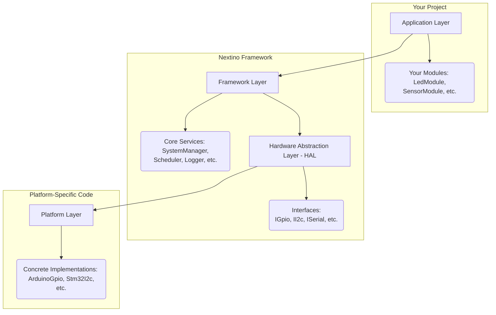
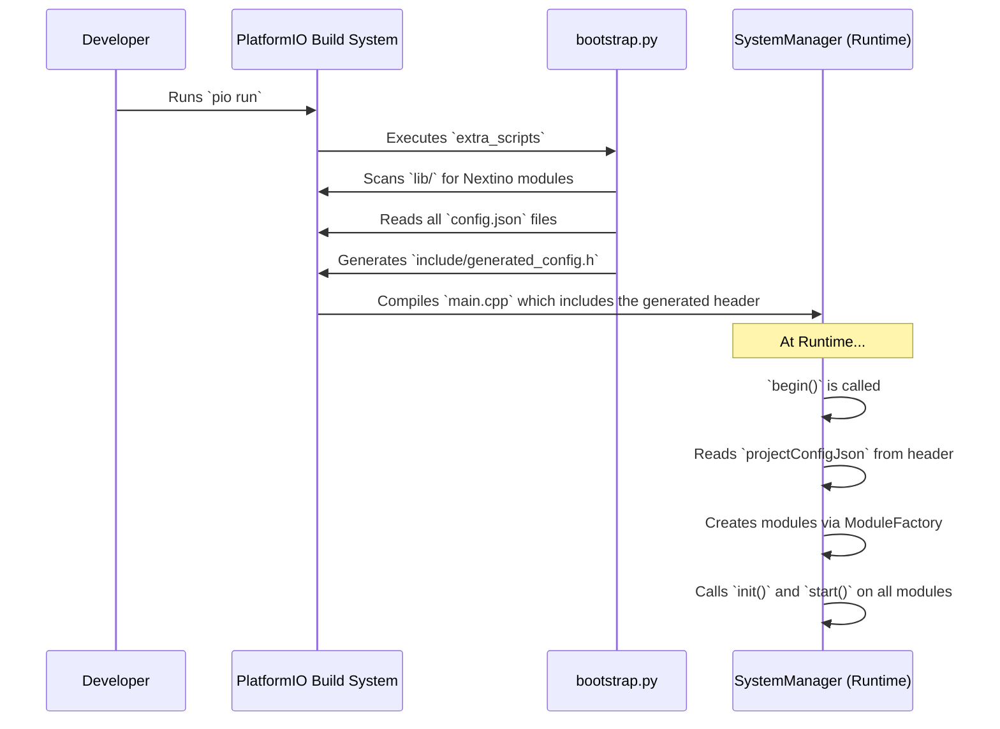

# 🏛️ Architecture Overview

Welcome to the engine room of Nextino! This document provides a high-level overview of the framework's architecture, its core components, and how they work together to create a structured and scalable environment for your embedded applications.

---

## The Layered Architecture

Nextino is designed with a clear separation of concerns, organized into distinct layers. This layered approach is key to achieving platform independence and code reusability.

1. **Application Layer:** This is where you live. Your custom modules reside here. They contain the unique business logic of your project (e.g., "if the temperature is above 30°C, turn on the fan"). Modules in this layer only talk to the Framework Layer.

2. **Framework Layer:** This is the core of Nextino. It provides the architectural backbone and essential services like the `SystemManager`, `Scheduler`, and `Logger`. It knows nothing about specific hardware.

3. **Hardware Abstraction Layer (HAL):** This is the crucial bridge. It defines a set of standard **interfaces** (like `IGpio` or `II2c`) for interacting with hardware. The framework layer uses these interfaces, not the concrete hardware functions.

4. **Platform Layer:** This layer contains the concrete **implementations** of the HAL interfaces for each specific platform (like Arduino, STM32, etc.). For example, `ArduinoGpio` implements the `IGpio` interface by calling `digitalWrite()`.

This separation means your Application Layer code can remain **100% platform-independent**.

---

## 🧩 The Core Components

The Framework Layer is built from a set of powerful singleton classes that manage the entire system.

* Note: You will need to create and upload a diagram image for this to work.*

* **SystemManager:** The central "orchestrator". It reads the configuration, creates modules, and manages their lifecycle (`init`, `start`, `loop`).

* **ModuleFactory:** The "builder". It knows how to construct module objects from the configuration data provided by the build script.

* **Scheduler:** The "timekeeper". It manages all non-blocking, time-based tasks, ensuring your `loop()` is fast and your application is responsive.

* **Logger:** The "narrator". It provides a centralized and professional way to output status messages, warnings, and errors.

* **ResourceManager (Future):** The "gatekeeper". It will manage exclusive access to hardware resources like pins to prevent conflicts.

* **EventBus & ServiceLocator (Future):** The "communication network". They will provide structured ways for modules to interact with each other.

---

## 🔄 The "Plug-and-Play" Data Flow

The "magic" of Nextino's automatic module discovery happens during the build process. Here’s a simplified view of the data flow:

This automated process ensures that your `main.cpp` remains clean and decoupled from the specific modules used in the project.

---

### Next Steps

Now that you understand the high-level architecture, let's dive into the details of a module's lifecycle.

➡️ **[The Lifecycle of a Module](./the-lifecycle-of-a-module.md)**
