# 📜 The Configuration System

One of the most powerful features of the Nextino framework is its **Configuration-Driven Architecture**. Instead of hard-coding which modules your project uses and how they are configured, you define everything in simple `config.json` files.

This approach decouples your application's logic from its structure, making your projects incredibly flexible, scalable, and easy to modify.

---

## 🎯 The Philosophy: Describe, Don't Code

The core idea is simple: **you describe your system in a configuration file, and the framework builds it for you.**

| Traditional Arduino (`main.cpp`)                               | Nextino (`main.cpp` + Config)                                                                                             |
| -------------------------------------------------------------- | ------------------------------------------------------------------------------------------------------------------------- |
| `LedModule led(2);`                                            | `main.cpp` is empty.                                                                                                      |
| `SensorModule sensor(0x76);`                                   | `config.json` contains: `{ "type": "LedModule", "config": { "pin": 2 } }`                                                  |
| `setup() { led.init(); sensor.init(); ... }`                   | `SystemManager` reads the config and builds the system automatically.                                                     |
| **Result:** `main.cpp` is tightly coupled to specific hardware. | **Result:** `main.cpp` is generic. To change the LED pin or add a sensor, you only edit the `config.json` file. |

---

## ⚙️ How It Works: The "Transparent Transformation"

Nextino uses a smart build script (`bootstrap.py`) to achieve this "magic" in a way that is completely transparent to you.

```mermaid
graph TD
    subgraph "Developer's Project"
        A["lib/LedFlasher/config.json"]
        B["lib/Sensor/config.json"]
        C["...other module configs..."]
    end

    subgraph "Build Process (&#96;pio run&#96;)"
        D{"&#96;bootstrap.py&#96; script runs"}
        A --> D
        B --> D
        C --> D
        D --> E["1. Aggregates all configs"]
        E --> F["2. Detects Target Platform"]
        F -- "ESP32/ESP8266" --> G["Strategy A: Creates `data/config.json`"]
        F -- "AVR/STM32" --> H["Strategy B: Creates `include/generated_config.h`"]
    end

    subgraph Runtime
        I[SystemManager]
        G --> I
        H --> I
        I --> J["Creates and runs modules"]
    end
```



### The Build Script (`bootstrap.py`)

Before your code is even compiled, our build script automatically:

1. **Scans** your project's `lib` directory.
2. **Finds** all libraries marked as a `"nextino-module"` in their `library.json`.
3. **Reads** the `config.json` file from each of these modules.
4. **Aggregates** them into a single, unified configuration.
5. **Transforms** this configuration into the optimal format for your target board.

### The Two Strategies

The script intelligently chooses the best way to store the configuration based on your board's capabilities:

#### Strategy A: Filesystem (for ESP32, ESP8266, etc.)

If your board has a filesystem like SPIFFS or LittleFS, the script will generate a single `data/config.json` file. At runtime, the `SystemManager` will read this file from the filesystem. This allows for dynamic, on-the-fly reconfiguration without recompiling!

#### Strategy B: Header File (for Arduino Uno, Nano, etc.)

If your board doesn't have a filesystem, the script generates a C++ header file (`include/generated_config.h`). This file contains the entire JSON configuration embedded as a `const char*` string. The `SystemManager` then reads the configuration directly from this compiled-in string.

**The best part? Your module code doesn't need to know or care which strategy is being used.**

---

## ✍️ Creating a `config.json` for Your Module

Every Nextino module should have a `config.json` file in its root directory.

```json title="Example: my_module/config.json"
{
  "type": "MyModuleClassName",
  "config": {
    "parameter1": "value",
    "parameter2": 123,
    "enabled": true
  }
}
```

* `"type"`: **(Required)** The exact name of your module's C++ class. This is how the `ModuleFactory` knows which object to create.
* `"config"`: **(Required)** An object containing all the parameters your module's constructor will need.

Inside your module's constructor, you can access these values like this:

```cpp
MyModule::MyModule(const JsonObject& config) {
    // Use the | operator to provide a default value if the key is missing
    myParam1 = config["parameter1"] | "default_string";
    myParam2 = config["parameter2"] | 456;
    isEnabled = config["enabled"] | true;
}
```

---

### Next Steps

Now that you know how modules are configured and created, let's explore the component that handles all the non-blocking magic.

➡️ **[The Scheduler](./the-scheduler)**
