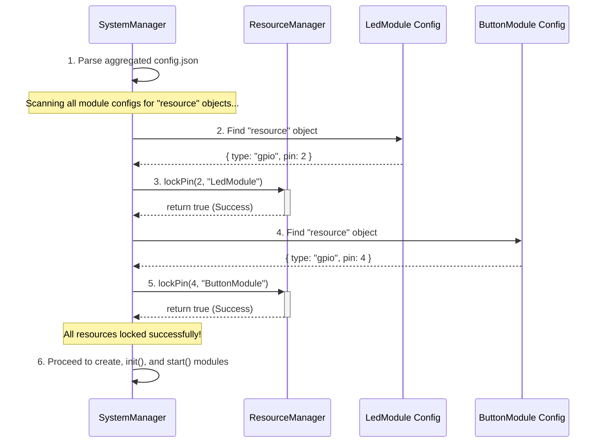

# 🛡️ The ResourceManager: Preventing Hardware Conflicts

In any embedded system with multiple components, one of the most common and difficult-to-debug problems is **resource conflict**: two different parts of the code trying to control the same hardware pin or peripheral at the same time.

The **`ResourceManager`** is a core Nextino service designed to completely eliminate this class of errors. It acts as a central, authoritative "gatekeeper" for all shared hardware resources.

---

## 🎯 The Philosophy: Declare, Don't Code

The `ResourceManager` operates on a simple, powerful principle: **modules declare the resources they need in a standardized way, and the framework manages them automatically.**

A module's code should never have to worry about whether a pin is available. It simply expects its hardware to be ready. The `SystemManager`, in coordination with the `ResourceManager`, handles the validation and locking behind the scenes.

This approach provides two major benefits:

1. **Conflict Detection at Startup:** Resource conflicts are detected when the application boots, not randomly during runtime. The system provides a clear error message and halts, preventing unpredictable behavior.
2. **Cleaner Module Code:** Module developers can focus on their logic, knowing that the framework guarantees them exclusive access to the resources defined in their configuration.

---

## ⚙️ How It Works: The Automatic Locking Process

The magic happens within the `SystemManager::begin()` method, before any module instances are even created.



### The Locking Sequence

1. **Configuration Parsing:** The `SystemManager` first parses the entire project configuration, which was automatically generated by the `bootstrap.py` script.
2. **Resource Scanning:** It then iterates through the configuration for **all** modules. For each module, it checks if its `config` object contains a special, standardized object named `"resource"`.
3. **Type-Based Locking:** If a `"resource"` object is found, the `SystemManager` inspects its `"type"` field (e.g., `"gpio"`, `"i2c"`) and calls the appropriate locking method on the `ResourceManager`. It passes the resource details (like the pin number or I2C address) and the module's type as the "owner".
4. **Conflict Check:** The `ResourceManager` checks its internal registry.
    * If the resource is available, it "locks" it for that owner and returns `true`.
    * If the resource is already locked by another module, it logs a critical **`RESOURCE CONFLICT!`** error and returns `false`.
5. **System Halt on Failure:** If any resource lock attempt fails, the `SystemManager` immediately stops the boot process and enters an infinite loop. This is a critical safety feature.
6. **Module Creation:** Only if **all** declared resources for **all** modules are locked successfully does the `SystemManager` proceed to create and initialize the modules.

---

## 🔧 The Standardized `"resource"` Object

To make your module compatible with the `ResourceManager`, you simply define its primary hardware interface using the `"resource"` object in its `config.json`. The framework will automatically find and lock it for you! 🪄

### Example 1: GPIO Resource 📌

This is the most common type, used for digital pins.

```json title="my_led_module/config.json"
{
  "type": "LedModule",
  "config": {
    "resource": {
      "type": "gpio",
      "pin": 2
    },
    "blink_interval_ms": 500
  }
}
```

### Example 2: I2C Resource 🤝

For modules that connect to an I2C device at a specific address. The `ResourceManager` will ensure that no two modules try to claim the same I2C address on the bus.

```json title="my_sensor_module/config.json"
{
  "type": "BME280_Module",
  "config": {
    "resource": {
      "type": "i2c",
      "address": "0x76"
    },
    "update_interval_ms": 10000
  }
}
```

### Example 3: SPI Resource 🚀

For SPI devices, the Chip Select (CS) pin is the unique resource that needs to be managed.

```json title="my_display_module/config.json"
{
  "type": "TFT_DisplayModule",
  "config": {
    "resource": {
      "type": "spi",
      "cs_pin": 15
    }
  }
}
```

### Example 4: UART Resource  SERIAL

For modules that communicate over a specific hardware serial port (e.g., connecting to a GPS module).

```json title="my_gps_module/config.json"
{
  "type": "GpsModule",
  "config": {
    "resource": {
      "type": "uart",
      "port": 2
    }
  }
}
```

### Example 5: ADC & DAC Resources 📈📉

For modules that use Analog-to-Digital or Digital-to-Analog converter pins.

```json title="my_potentiometer_module/config.json"
{
  "type": "PotentiometerModule",
  "config": {
    "resource": {
      "type": "adc",
      "pin": 34
    }
  }
}
```

This unified structure makes the framework incredibly powerful and extensible. Adding support for new resource types in the future is straightforward and won't require changes to existing modules.

---

### Next Steps

Now that you understand how Nextino manages resources, let's look at how modules can communicate with each other.

➡️ **[Communication Patterns](./communication-patterns.md)**
