# ⏱️ The Scheduler: Non-Blocking by Default

One of the biggest challenges in traditional Arduino programming is managing time. The simple `delay()` function is easy to use, but it's a trap 덫: it completely freezes your microcontroller, preventing it from doing anything else.

Nextino solves this with a built-in, non-blocking **Scheduler**. It's the heart of the framework's responsive, multitasking capability. ❤️

---

## 🚫 The Problem with `delay()`

Imagine you want to blink an LED every second and also check for a button press. A traditional approach might look like this:

```cpp title="Traditional Arduino Code (The Bad Way 👎)"
void loop() {
  digitalWrite(LED_PIN, HIGH);
  delay(1000); // The MCU is completely frozen here for 1 second! 🥶
  digitalWrite(LED_PIN, LOW);
  delay(1000); // And frozen again...

  // What if the user presses a button during the delay?
  // Too bad! The program won't notice until the delay is over.
  checkButton(); 
}
```

This code is **blocking**. While the `delay()` is running, the processor can't read sensors, respond to inputs, or handle network traffic. For any serious project, this is unacceptable.

## ✨ The Nextino Solution: Cooperative Multitasking

The Nextino `Scheduler` allows you to schedule functions (callbacks) to run at specific intervals without ever blocking the main loop. This is a form of **cooperative multitasking**.

The `SystemManager` calls `Scheduler::loop()` on every single iteration of the main program `loop()`. The scheduler quickly checks its list of tasks and executes only those whose time has come.

```mermaid
graph LR
    subgraph "Main `loop()`"
        A["NextinoSystem().loop()"]
    end

    subgraph "`NextinoSystem().loop()`"
        B["Scheduler.loop()"] --> C{"Time for Task A? ⏰"};
        C -- Yes ✅ --> D["Execute Task A"];
        C -- No ❌ --> E{"Time for Task B? ⏰"};
        E -- Yes ✅ --> F["Execute Task B"];
        E -- No ❌ --> G["..."];
    end

    style A fill:#9f6,stroke:#333,stroke-width:2px
```



This entire process is incredibly fast. If no tasks are due, `Scheduler::loop()` finishes in microseconds, allowing other modules to run their `loop()` methods immediately. 🚀

---

## 🛠️ How to Use the Scheduler

The Scheduler provides simple and powerful methods for managing tasks. You typically call these from your module's `start()` or other logic methods.

### `scheduleRecurring(intervalMs, callback)`

This is the most common method. It schedules a function to be called repeatedly with a fixed interval.

* `intervalMs`: The time in milliseconds between each execution.
* `callback`: The function to be called. This is often a C++ lambda function.
* **Returns:** A unique `TaskHandle` (a `uint32_t`) that you can use to cancel the task later.

```cpp title="Example: LedModule::start()"
void LedModule::start() {
    // Schedule the toggle() method to be called every 500 milliseconds.
    _blinkTaskHandle = NextinoScheduler().scheduleRecurring(500, [this]() {
        this->toggle(); 
    });
    NEXTINO_LOGI(getName(), "Blink task scheduled with handle %u.", _blinkTaskHandle);
}

void LedModule::toggle() {
    digitalWrite(_pin, !digitalRead(_pin));
}
```

### `scheduleOnce(delayMs, callback)`

This method schedules a function to be called only **once** after a specified delay.

* `delayMs`: The time in milliseconds to wait before execution.
* `callback`: The function to be called.
* **Returns:** A unique `TaskHandle`.

```cpp title="Example: A hypothetical WelcomeModule"
void WelcomeModule::start() {
    // After a 2-second delay, print a welcome message.
    NextinoScheduler().scheduleOnce(2000, []() {
        NEXTINO_LOGI("WelcomeModule", "System is ready! Welcome! 👋");
    });
}
```

### `cancel(handle)`

Need to stop a task you previously scheduled? No problem!

* `handle`: The `TaskHandle` that was returned by `scheduleRecurring` or `scheduleOnce`.

```cpp title="Example: Stopping a blink task"
void LedModule::stopBlinking() {
    if (_blinkTaskHandle != 0) {
        bool success = NextinoScheduler().cancel(_blinkTaskHandle);
        if (success) {
            NEXTINO_LOGI(getName(), "Successfully cancelled blink task.");
            _blinkTaskHandle = 0; // Reset the handle
        }
    }
}
```

---

## 💡 Best Practices

* **Keep Callbacks Short & Fast:** Your scheduled functions should execute quickly. ⚡
* **No `delay()` in Callbacks:** Never use `delay()` inside a scheduled callback. This defeats the entire purpose of the non-blocking scheduler.
* **Register in `start()`:** The best place to schedule your initial tasks is in your module's `start()` method.

By embracing the Scheduler, you can build complex, multi-tasking applications that are responsive, efficient, and easy to reason about.

---

### Next Steps

Now that you understand the core components, let's look at how they communicate.

➡️ **[Communication Patterns](./communication-patterns.md)**
