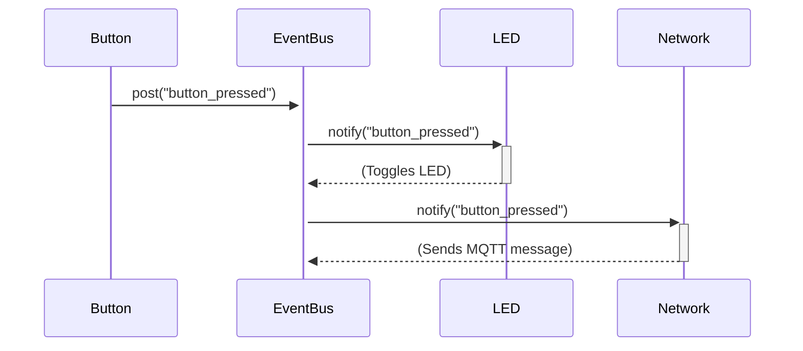
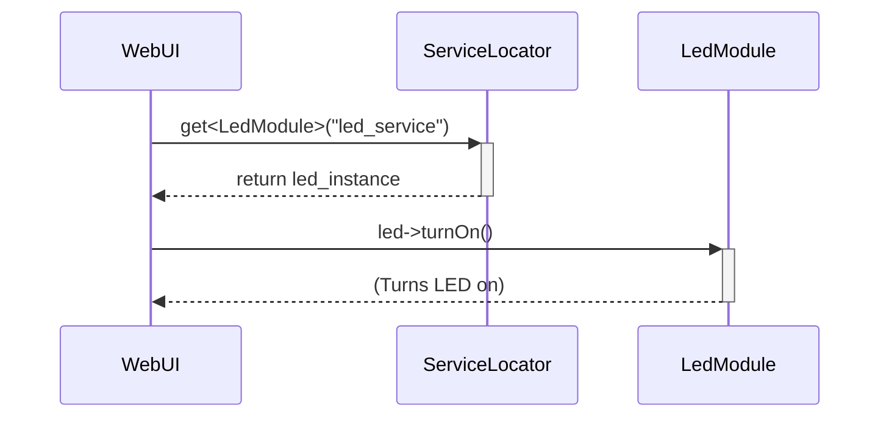

# 💬 Communication Patterns

In a modular framework like Nextino, a critical question is: "How do modules talk to each other?" 🤔

A naive approach would be for one module to directly call a function in another. This creates **tight coupling**, a developer's nightmare. If you change one module, you might break ten others that depend on it. 💥

Nextino solves this by providing a set of standardized **communication patterns** that ensure your modules remain decoupled, independent, and reusable.

---

## The Golden Rule: No Direct Dependencies Rule

> **Modules must never directly include each other's header files or call each other's methods.**

Instead of direct calls, all communication is mediated through the framework's core services.

## Pattern 1: The Event Bus (for Broadcasting) 📢

* **Status:** ✅ **Implemented & Ready to Use!**
* **Use Case:** When a module needs to announce that something has happened, without knowing (or caring) who is listening. This is a "one-to-many" or "publish-subscribe" pattern.

**Analogy:** Think of it like a radio station 📻. A module (the DJ) broadcasts a message (a song) on a specific channel (the event name, e.g., `"button_pressed"`). Any other module that is "tuned in" to that channel will receive the message. The DJ doesn't need to know who the listeners are.

**Example Scenario:**
A `ButtonModule` detects a press. It posts a `"button_pressed"` event to the `EventBus`. A `LedModule` and a `NetworkModule` are both subscribed to this event. Upon receiving it, the `LedModule` toggles its state, and the `NetworkModule` sends an MQTT message. The `ButtonModule` has no idea that the other two modules even exist. ✨

**When to use it:**

* 📣 Broadcasting sensor readings.
* 🔔 Notifying the system of state changes (e.g., "WiFi connected").
* 🎬 Triggering actions in multiple, unrelated modules from a single source.

## Pattern 2: The Service Locator (for Direct Requests) 📞

* **Status:** ✅ **Implemented & Ready to Use!**
* **Use Case:** When one module needs to request a specific action or piece of data from **another specific module**. This is a "one-to-one" or "request-response" pattern.

**Analogy:** Think of it like a phone book 📖. A module (the caller) needs a specific service (e.g., "the logger"). It asks the `ServiceLocator` (the phone book) for the `"led_service"`. The `ServiceLocator` provides a direct line (a pointer) to the `LedModule` instance, allowing the caller to use its public methods.

**Example Scenario:**
A `WebUIModule` needs to turn on an LED. It asks the `ServiceLocator` for the `"led_service"`. The `ServiceLocator` returns a pointer to the `LedModule`. The `WebUIModule` can then call `led->turnOn()`. The `WebUIModule` doesn't need to know how the `LedModule` was created or where it is in memory; it only needs to know its registered name.

**When to use it:**

* 🕹️ When a module needs to control another module directly (e.g., a `WebUIModule` telling a `RelayModule` to turn on).
* 📊 When a module needs to fetch data on demand from another module.
* 🛠️ For accessing shared, system-wide services.

---

## Summary Table 📋

| Pattern         | Communication Style | Analogy        | Use For...                               |
| --------------- | ------------------- | -------------- | ---------------------------------------- |
| **Event Bus**   | One-to-Many (Async) | Radio Station  | Notifications, state changes, broadcasting |
| **Service Locator** | One-to-One (Sync)   | Phone Book     | Direct commands, data requests, services |

By choosing the right pattern for the job, you can build complex applications that remain clean, decoupled, and easy to maintain. Happy coding! 💖

---

### Next Steps

You've now learned about the core architectural concepts of Nextino. It's time to get your hands dirty and build your first module!

➡️ **[Tutorial: Creating a Custom Module](/tutorials/creating-a-custom-module)**
