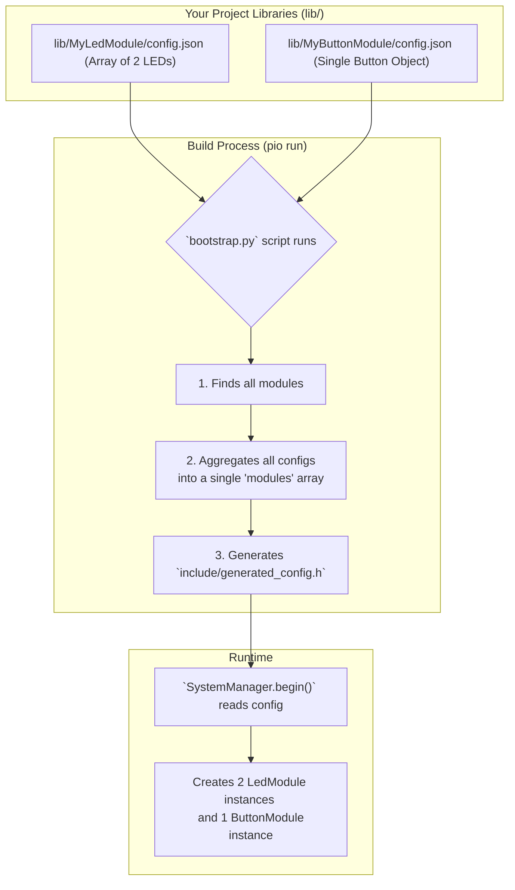

# 📜 The Configuration System

One of the most powerful features of the Nextino framework is its **Configuration-Driven Architecture**. Instead of hard-coding which modules your project uses, you define everything in simple `config.json` files. 🤖

This approach decouples your application's logic from its structure, making your projects incredibly flexible, scalable, and easy to modify.

---

## 🎯 The Philosophy: Describe, Don't Code

The core idea is simple: **you describe your system in a configuration file, and the framework builds it for you.** ✨

| Traditional Arduino (`main.cpp`) | Nextino (`main.cpp` + Config) |
| --- | --- |
| `LedModule mainLed(2);` <br/> `LedModule errorLed(4);` | `main.cpp` is minimal and doesn't know about LEDs. |
| `setup() { mainLed.init(); ... }` | A `config.json` file describes both LEDs. |
| **Result:** `main.cpp` is tightly coupled to specific hardware and structure. | **Result:** To add a third LED or change a pin, you **only edit the `config.json` file**. |

This means you can build complex systems with dozens of components without ever touching your main application file!

---

## ⚙️ The Architecture: An Array of Instances

In Nextino, the entire system is defined by an **array of module instances**. The build script (`bootstrap.py`) scans all your module libraries, finds their `config.json` files, and intelligently aggregates them into a single, master configuration.

Each module's `config.json` can define a single module instance (as a JSON object) or **multiple instances** (as a JSON array).



The magic is that `bootstrap.py` is smart enough to combine everything. If it finds a JSON object, it wraps it in an array. If it finds an array, it adds its elements to the final list. This keeps your module configurations clean and simple.

---

## ✍️ Creating a `config.json` for Your Module

Every Nextino module library must have a `config.json` file in its root. This file defines the **default instance(s)** for that module.

### Example 1: Single Instance Configuration (JSON Object)

This is the simplest format, used for modules that you typically only have one of.

```json title="lib/MyUniqueModule/config.json"
[
    {
        "type": "MyModuleClassName",
        "instance_name": "my_unique_instance",
        "config": {
            "parameter1": "value",
            "parameter2": 123
        }
    }
]
```

### Example 2: Multiple Instances Configuration (JSON Array)

This format is perfect for when you want to define several instances of the same module type, like multiple LEDs or Relays.

```json title="lib/MyLeds/config.json"
[
  {
    "type": "LedModule",
    "instance_name": "status_led",
    "config": {
      "resource": { "type": "gpio", "pin": 2 },
      "blink_interval_ms": 1000
    }
  },
  {
    "type": "LedModule",
    "instance_name": "error_led",
    "config": {
      "resource": { "type": "gpio", "pin": 4 },
      "blink_interval_ms": 250
    }
  }
]
```

### Key Fields Explained

* `"type"`: **(Required)** The exact name of your module's C++ class. This is how the `ModuleFactory` knows which object to create.
* `"instance_name"`: **(Required)** A unique name for this specific instance. This name is crucial for:
  * 🏷️ **Logging:** To identify which instance is sending a message.
  * 📞 **ServiceLocator:** To request a specific instance (e.g., `"led:error_led"`).
  * 🛡️ **ResourceManager:** To see who owns a hardware pin.
* `"config"`: **(Required)** An object containing all the parameters your module's constructor will need.

Inside your module's C++, you access the configuration values as before:

```cpp
MyModule::MyModule(const char* instanceName, const JsonObject& config)
    : BaseModule(instanceName) { // Always pass instanceName to the parent!
    
    // Use the | operator to provide a default value if the key is missing
    myParam1 = config["parameter1"] | "default_string";
    myParam2 = config["parameter2"] | 456;
}
```

---

### Next Steps

Now that you understand how your system's structure is defined, let's look at how to build your very first module according to these new rules.

➡️ **[Creating a Custom Module](/tutorials/creating-a-custom-module)**
