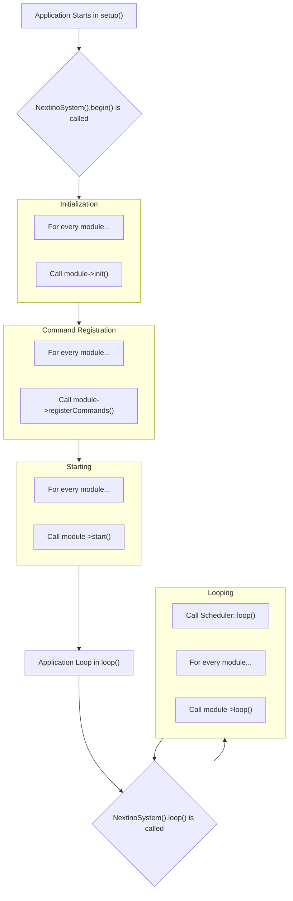

# 🔄 The Lifecycle of a Module

Every module in the Nextino framework follows a consistent and predictable lifecycle, managed entirely by the `SystemManager`. Understanding this lifecycle is key to writing clean, efficient, and bug-free modules.

The lifecycle consists of four main phases managed by `SystemManager::begin()`: **Initialization**, **Command Registration**, and **Starting**, followed by the continuous **Looping** phase.

---

## The Journey of a Module 🛤️

Here's a step-by-step breakdown of what happens from the moment your application starts.



### Phase 1: Initialization (`init()`)

* **When is it called?** The `init()` method of every registered module is called **once**, in sequence, during `NextinoSystem().begin()`.
* **What should you do here?** This is the place for one-time setup that prepares your module but doesn't start active processes.
  * ✅ **Good:** Setting pin modes (`pinMode()`), initializing hardware libraries (`Wire.begin()`), providing a service to the `ServiceLocator`.
  * ❌ **Bad:** Starting a blinking task, subscribing to events.

```cpp title="Example: LedModule::init()"
void LedModule::init() {
    // Set the pin to be an output. This only needs to happen once.
    pinMode(_pin, OUTPUT);
    
    // Provide this instance as a service for other modules to use.
    std::string serviceName = std::string(getName()) + ":" + getInstanceName();
    NextinoServices().provide(serviceName.c_str(), this);

    NEXTINO_LOGI(getInstanceName(), "Initialized on pin %d.", _pin);
}
```

### ✨ Phase 2: Command Registration (`registerCommands()`)

* **When is it called?** The `registerCommands()` method is called **once** for every module, right after the `init()` phase is complete for *all* modules.
* **What should you do here?** This is the dedicated place to tell the `CommandRouter` what text-based commands your module supports.
  * ✅ **Good:** Calling `NextinoCommands().registerCommand(...)` to expose methods like `turnOn()` or `getStatus()`.
  * ❌ **Bad:** Any other logic. This method should be reserved strictly for command registration.

```cpp title="Example: LedModule::registerCommands()"
void LedModule::registerCommands() {
    NextinoCommands().registerCommand(getInstanceName(), "on", [this](auto args) {
        this->turnOn();
        return "OK";
    });
    NEXTINO_LOGD(getInstanceName(), "Registered 'on' command.");
}
```

### Phase 3: Starting (`start()`)

* **When is it called?** The `start()` method is called **once** for every module, immediately after **all** modules have completed their `init()` and `registerCommands()` phases.
* **Why the separation?** This multi-phase approach is crucial. It guarantees that when your module's `start()` method is called, you can safely assume that **all other modules have been initialized and all services/commands are available**.
* **What should you do here?** This is where you kick off the active, ongoing processes.
  * ✅ **Good:** Scheduling tasks with the `Scheduler`, subscribing to events on the `EventBus`.
  * ❌ **Bad:** One-time hardware setup or command registration.

```cpp title="Example: LedModule::start()"
void LedModule::start() {
    // Subscribe to an event to react to other parts of the system.
    NextinoEvent().on("button_press", [this](void* p) { this->toggle(); });
    NEXTINO_LOGI(getInstanceName(), "Subscribed to 'button_press' event.");
}
```

### Phase 4: Looping (`loop()`)

* **When is it called?** The `loop()` method of every module is called on **every single iteration** of the main Arduino `loop()`.
* **What should you do here?** This is for logic that needs to be checked continuously and cannot be handled by a timed scheduler.
  * ✅ **Good:** Reading a sensor that changes rapidly, updating a state machine.
  * ⚠️ **Crucial:** The `loop()` method **must be non-blocking**. Never use `delay()` or long-running `while` loops, as this will freeze the entire framework.

---

### Summary Table: Where to Put Your Code 📍

| If you need to... | Put your code in... |
| :--- | :--- |
| Set up hardware or provide a service | `init()` |
| Register a text-based command | `registerCommands()` |
| Start a recurring task or subscribe to an event | `start()` |
| Continuously check something (non-blocking) | `loop()` |

---

### Next Steps

Now that you understand the full lifecycle, let's explore the powerful configuration system that brings these modules to life.

➡️ **[The Configuration System](./configuration-system)**
